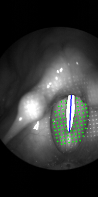

 

# The Human Laser Endoscopic (HLE) Dataset
This repository contains the human-laser endoscopic dataset proposed in the Paper **Real-Time 3D Reconstruction of Human Vocal Folds via High-Speed Laser-Endoscopy**.
It contains 10 high-speed in-vivo endoscopy videos of human vocal folds during phonation, that were captured using a 4000 FPS camera.
While recording, a laser projection unit projected a symmetric 18 by 18 laser grid pattern into the laryngeal area.
For further information about the system used to record these videos, please have a look at the paper: <a href="https://www.mdpi.com/2076-3417/7/6/600">Endoscopic laser-based 3d imaging for functional voice diagnostics</a> by Semmler et al.
**We are currently in the process of including the silicone vocal fold data presented in the paper in this repository as well. Please be patient.**

This is a joint work of the <a href="https://www.lgdv.tf.fau.de/">Chair of Visual Computing</a> of the Friedrich-Alexander University of Erlangen-Nuremberg and the <a href="https://www.hno-klinik.uk-erlangen.de/phoniatrie/">Phoniatric Division</a> of the University Hospital Erlangen.

## Files
* visualize.py - An example on how to use the data supplied in this dataset.
* camera_calibration.json - Contains the intrinsic 3x3 camera matrix, as well as the distortion coefficients.
* laser_calibration.json - Contains the lasers rotation matrix, the inter-laser angle alpha, the laser grid dimensions and lastly the 3D-translation of the laser.
* [A-Z][A-Z]/[A-Z][A-Z].avi the actual recording of size 512x256 (HEIGHT x WIDTH).
* [A-Z][A-Z]/[A-Z][A-Z].json labels extracted from the video. For further instructions have a look at __Data__.
	
## Data
The data in the specific json files contain:
* **GlottalSegmentation**: The Glottal Segmentation as per Frame Polygons of type FRAME_NUM x VERTICES x 2
* **GlottalMidline**: The Glottal Midline per Frame of type FRAME_NUM x 2 x 2
* **2DPoints**: The 2d points lying on the superior surface of the vocal folds of type FRAME_NUM x X x Y x 2. Points are of type NaN, if they are not visible inside the Frame.
* **3DPoints**: The triangulated 3D Points of type FRAME_NUM x N x 3
* **Offset**: The X- and Y-Offsets of the 2D Points that need to be added to the X and Y Coordinates of the 2DPoints to reconstruct the correct labels.

## Examples


## Citation
Please cite this paper, if this work helps you with your research:
```
@InProceedings{10.1007/978-3-031-16449-1_1,
  author="Henningson, Jann-Ole and Stamminger, Marc and D{\"o}llinger, Michael and Semmler, Marion",
  title="Real-Time 3D Reconstruction of Human Vocal Folds via High-Speed Laser-Endoscopy",
  booktitle="Medical Image Computing and Computer Assisted Intervention -- MICCAI 2022",
  year="2022",
  pages="3--12",
  isbn="978-3-031-16449-1"
}
```
You can find a PDF of the Paper in the <a href="https://github.com/Henningson/Vocal3D">Vocal3D Repository</a>.
Or get it here: <a href="https://link.springer.com/chapter/10.1007/978-3-031-16449-1_1">Springer Link</a>.
